```{r setup, include=FALSE}
knitr::opts_chunk$set(echo = FALSE, dpi = 300)

library(knitr)
```


## Ancient DNA and conservation {.columns-2}

1. Introduction to ancient DNA
2. Properties of ancient DNA
3. Case studies: 
    - Great Auk
    - Iberian Lynx


```{r, out.width = 400, fig.align='right'}
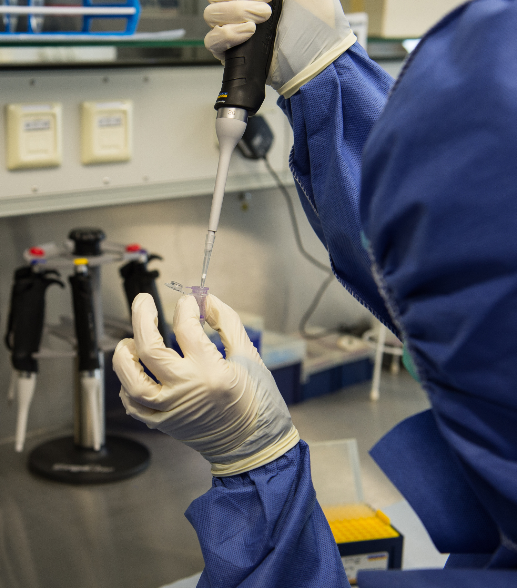
```


## Do you think ancient DNA is important? {.columns-2}


```{r, out.height=490, fig.align='center'}
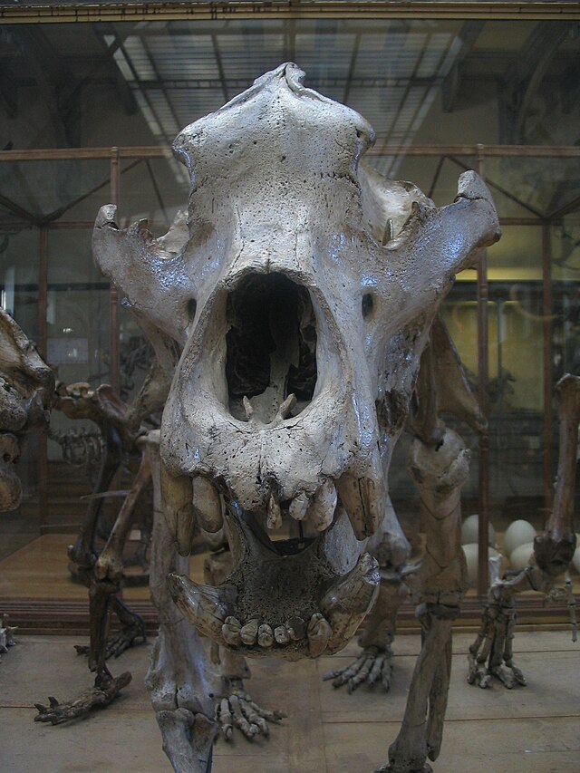
```

```{r, out.height=490, fig.align='center'}
include_graphics("./img/sabretooth_portrait.jpg")
```


## Tracking populations through time

```{r, out.width=500, fig.align='center'}
include_graphics("./img/1-onespeciesma_edit1.png")
```


<center><font size="4">*Credit: Claudiu Pantiru/Max Planck Institute for the Science of Human History*</font></center>


## Introduction to the field {.flex-cols}  

```{r, out.width = "300"}
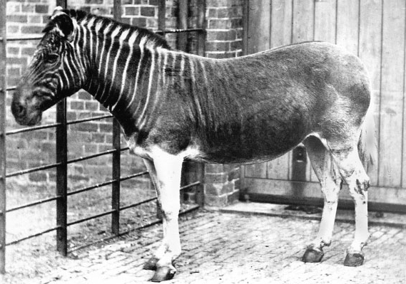
```


```{r, out.width = "100%", out.height=500}
include_graphics("./pdf/Higuchi_1984_Quagga.pdf")
```


## Young but highly prolific

```{r, out.height=470, fig.align='center'}
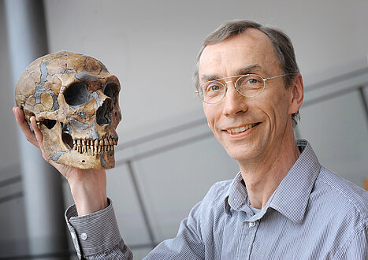
```

<center>*Svante Pääbo, Nobel Laureate 2022*</center>


## "Teething" problems...

```{r, out.width = "100%", out.height=500}
include_graphics("./pdf/Paabo_1985_mummy.pdf")
```

## Sorry, no dinosaurs... {.flex-cols}

```{r, out.width = 300, fig.align='center'}
include_graphics("./img/riding_dino.png")
```

```{r, out.width = "100%", out.height=500}
include_graphics("./pdf/Woodward_1994_dino.pdf")
```


## First Pleistocene DNA in 1994 {.flex-cols}

```{r, out.width = 300, fig.align='center'}
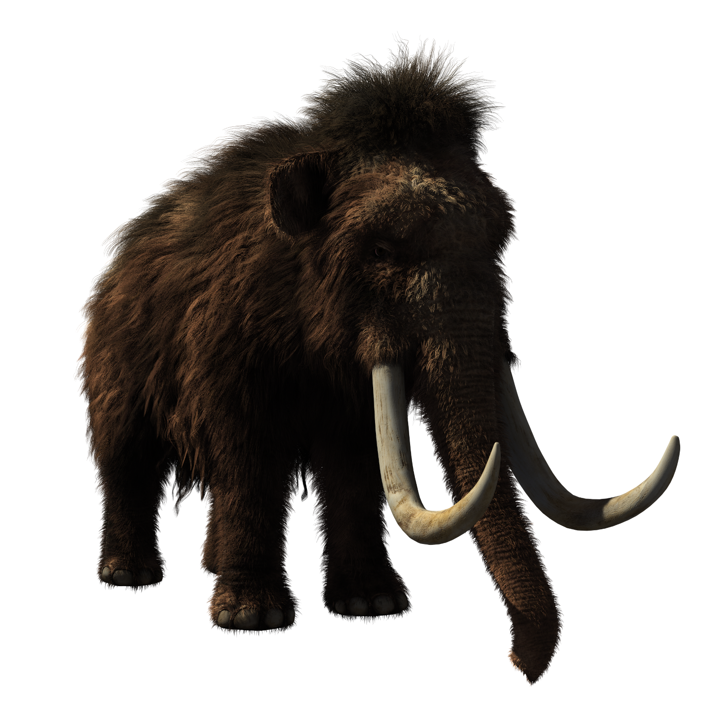
```


```{r, out.width = "100%", out.height=500}
include_graphics("./pdf/Hagelberg_1994_mammoth.pdf")
```

## First Pleistocene genome in 2010 {.flex-cols}

```{r, out.width = 300, fig.align='center'}
include_graphics("./img/neanderthal.jpg")
```


```{r, out.width = "100%", out.height=500}
include_graphics("./pdf/Green et al. - 2010 - A Draft Sequence of the Neandertal Genome.pdf")
```

## Where can you get it {.flex-cols .vcenter}

- bones
- teeth
- soft tissue (permafrost, mummies)
- coprolites
- sediments

<br>

```{r, out.width = 550, fig.align='right'}

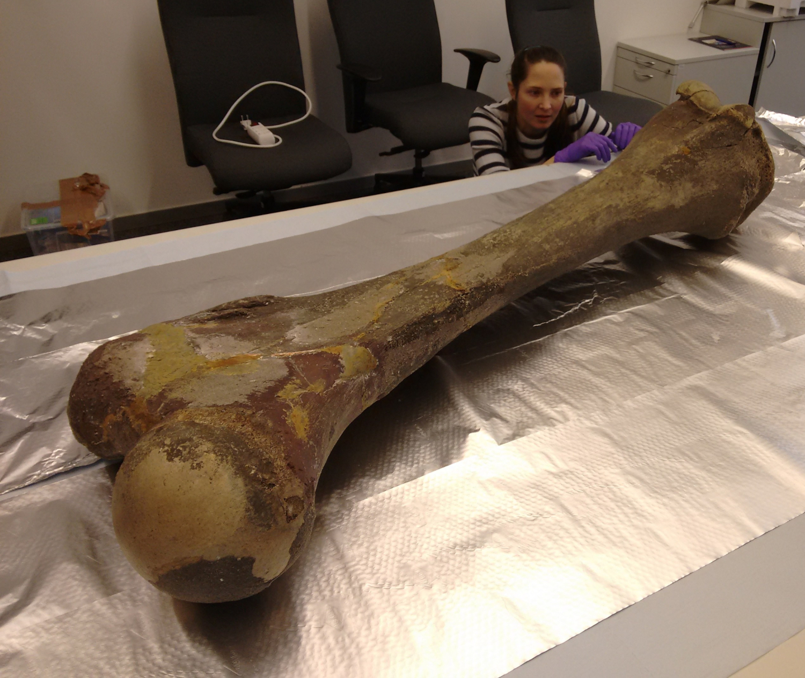

```

## What can you get* {.columns-2}

- DNA fragmentation
- Small quantities
- High levels of contamination 
- DNA degradation

<font size="4">* *(usually) *</font>


```{r, out.width = 500, fig.align='right'}
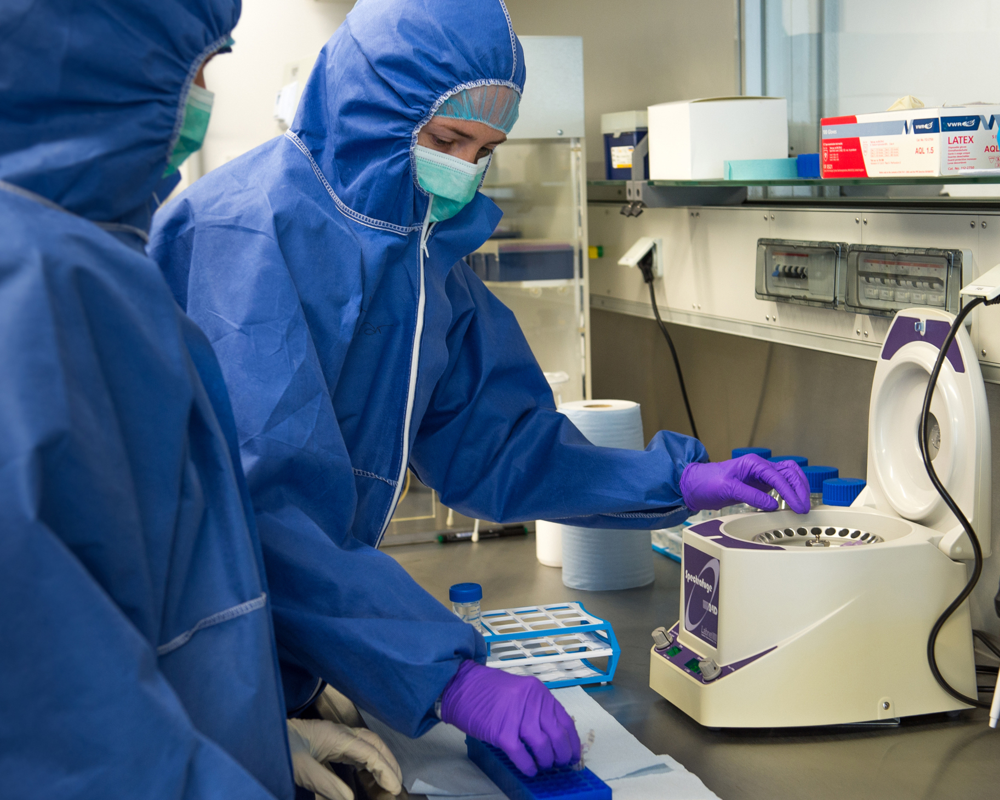

```


## What can you get (in Bangor) {.columns-2}

```{r, out.width = "80%", fig.align='center'}
include_graphics("./img/cleanlab_axel.jpg")
```

```{r, out.width = "80%", fig.align='center'}
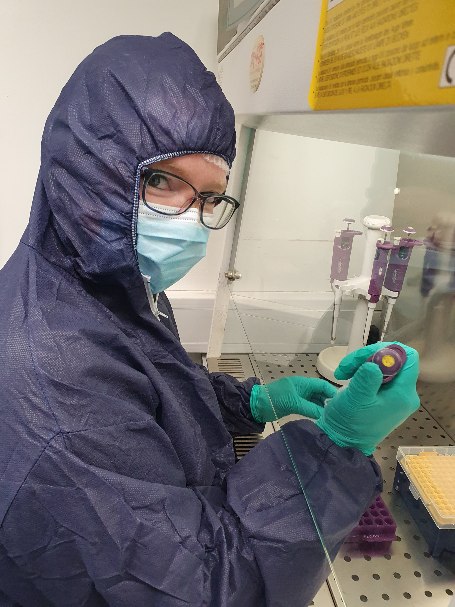
```

## Ancient DNA timeline {.flexbox .vcenter}

```{r, out.width = "100%", fig.align='center'}
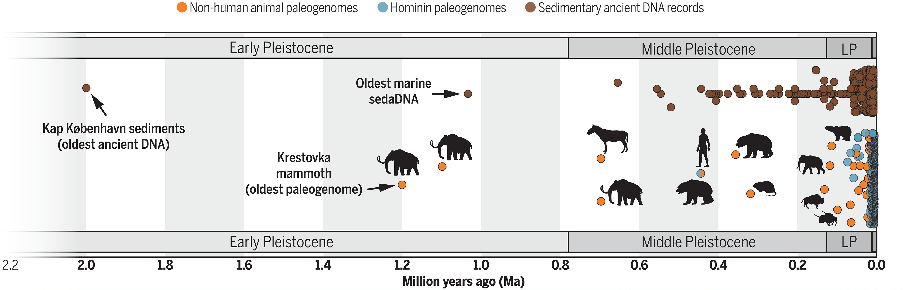
```

<P align="right"><font size="4">*Dalén et al. 2023, Science*</font></P>


# Fragmentation

## DNA fragmentation {.flexbox .vcenter}


```{r, out.width = 750, fig.align='center'}
include_graphics("./img/readlength.svg")
```

***→ Gets worse with time and poor preservation conditions***

## DNA fragmentation: PCR {.flexbox .vcenter}

```{r, out.width = 800, fig.align='center'}
include_graphics("./img/pcr_issue.svg")
```

## DNA fragmentation: PCR {.flexbox .vcenter}

```{r, out.width = 800, fig.align='center'}
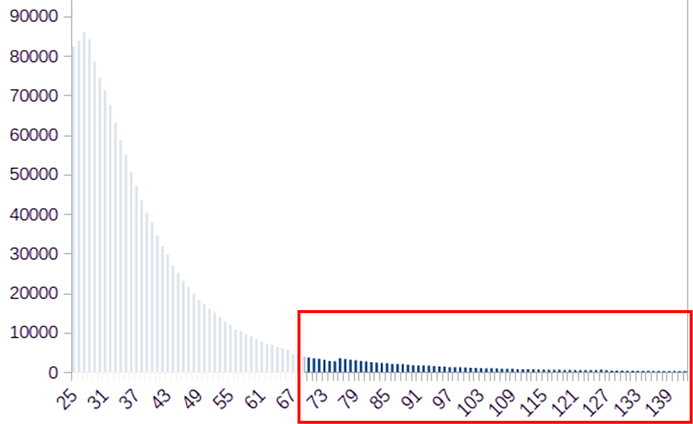
```

## DNA fragmentation: NGS {.flexbox .vcenter}

```{r, out.width = 800, fig.align='center'}
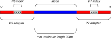
```

## DNA fragmentation: NGS {.flexbox .vcenter}

```{r, out.width = 800, fig.align='center'}
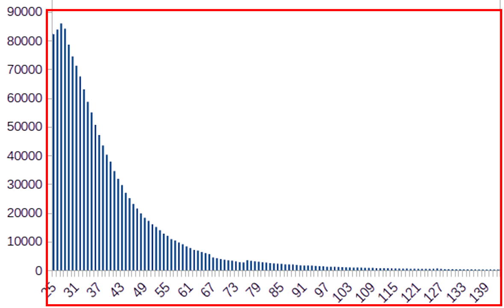
```


# Low quantity / high contamination

## Endogenous vs exogenous DNA {.flex-cols}

```{r, out.width="75%", fig.align='center', fig.width=4, fig.height=4}
par(bg = "transparent", mar=c(2, 4, 1, 2))

# Define the data
labels <- c("DNA you want", "Other Stuff")

# Create a bar chart
barplot(c(10, 90), names.arg = labels, col = c("red", "darkgrey"), 
        ylim = c(0, 100), ylab = "Amount of output data", border = "white")

```

```{r, out.height = 500, fig.align='center'}
include_graphics("./img/contamination.png")
```

## "Brute force" sequencing

```{r, out.width = 800, fig.align='center'}
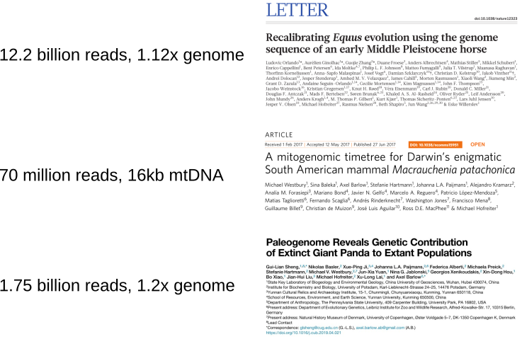
```


## Targetting the right sample  {.flex-cols}


```{r, out.width = 550, fig.align='center'}
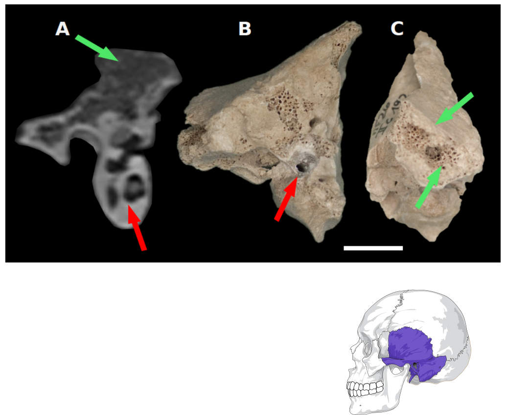
```


```{r, out.width = 450, fig.align='center', fig.cap="*Alberti et al. 2019, Mol Ecol Resources*"}
include_graphics("./img/alberti_petrous.png")
```


## Targetting the right sample 

```{r, out.width = 550, fig.align='center'}
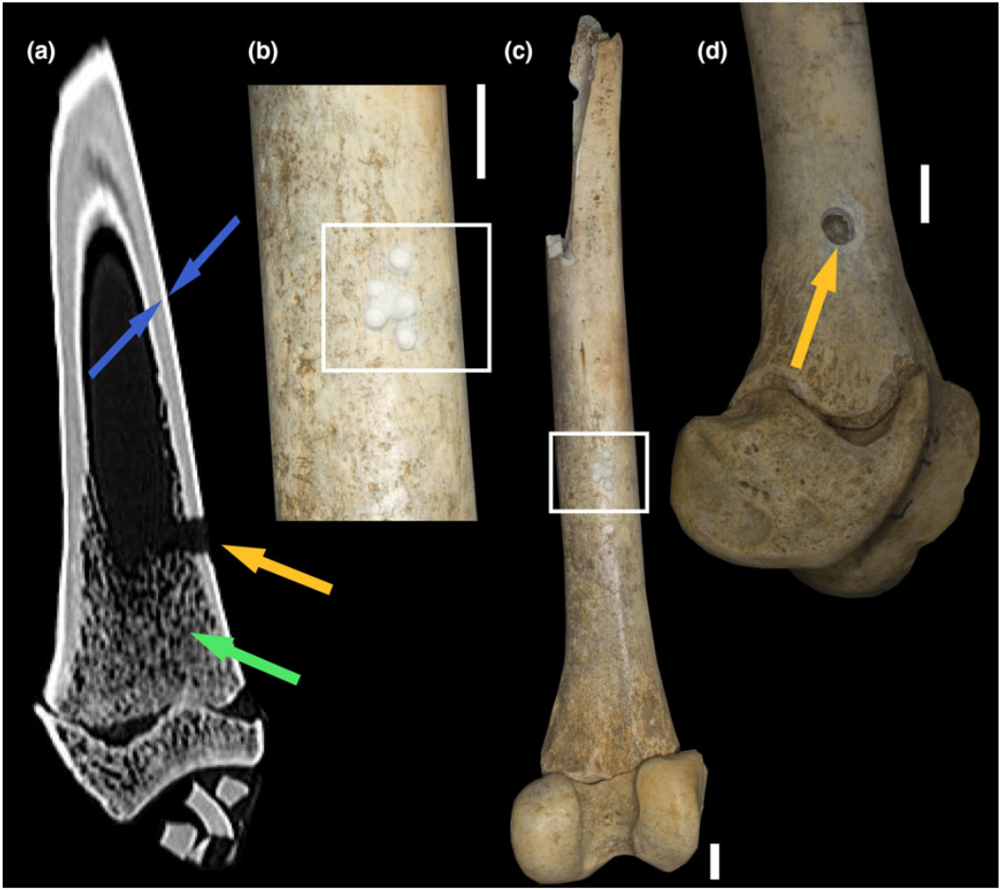
```

<P align="right"><font size="4">*Alberti et al. 2018, Mol Ecol Resources*</font></P>


## Pre-treatment

- bleach, phosphate or pre-digestion

```{r, out.width = 500, fig.align='center'}
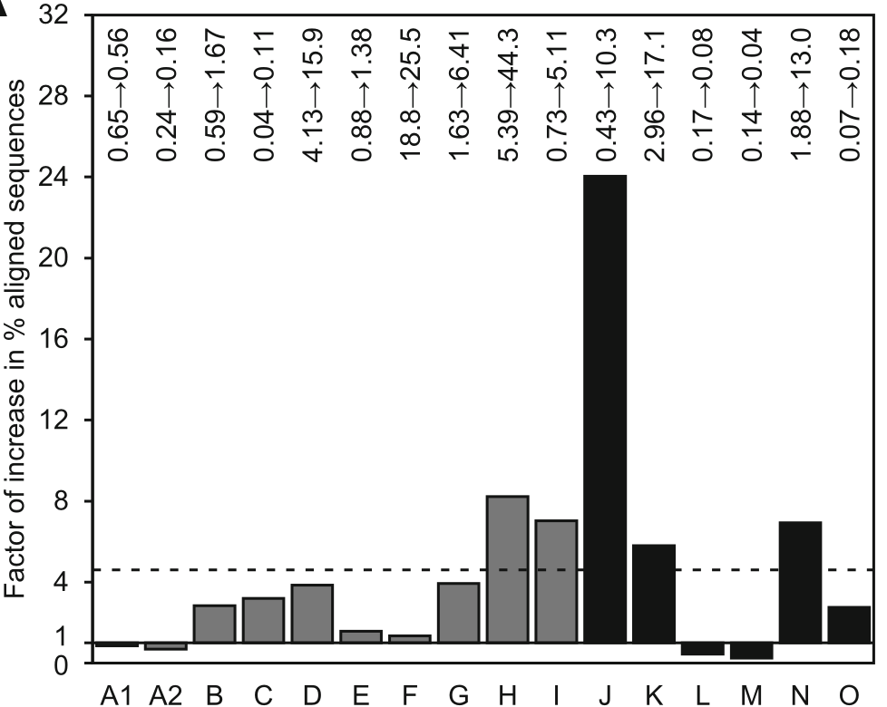
```

<P align="right"><font size="4">*Korlević & Meyer 2019, Ancient DNA: Methods and Protocols*</font></P>


## Hybridisation capture {.flex-cols}

```{r, out.width = 450, fig.align='center'}
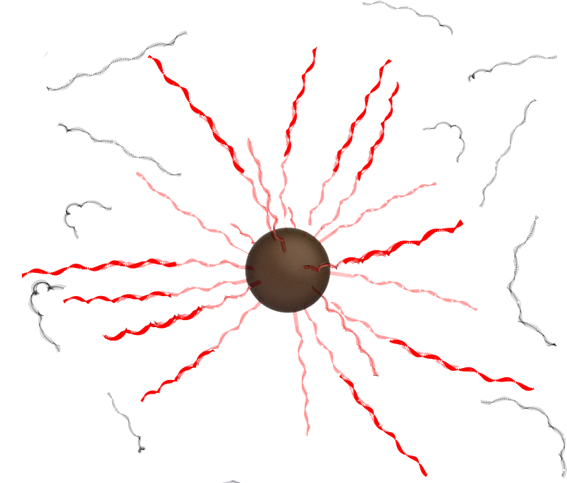
```

```{r, out.width = 450, fig.align='center'}
include_graphics("./img/capture_slide.png")
```


## Hybridisation capture workflow {.flex-cols}

```{r, out.width = 540, fig.align='center'}
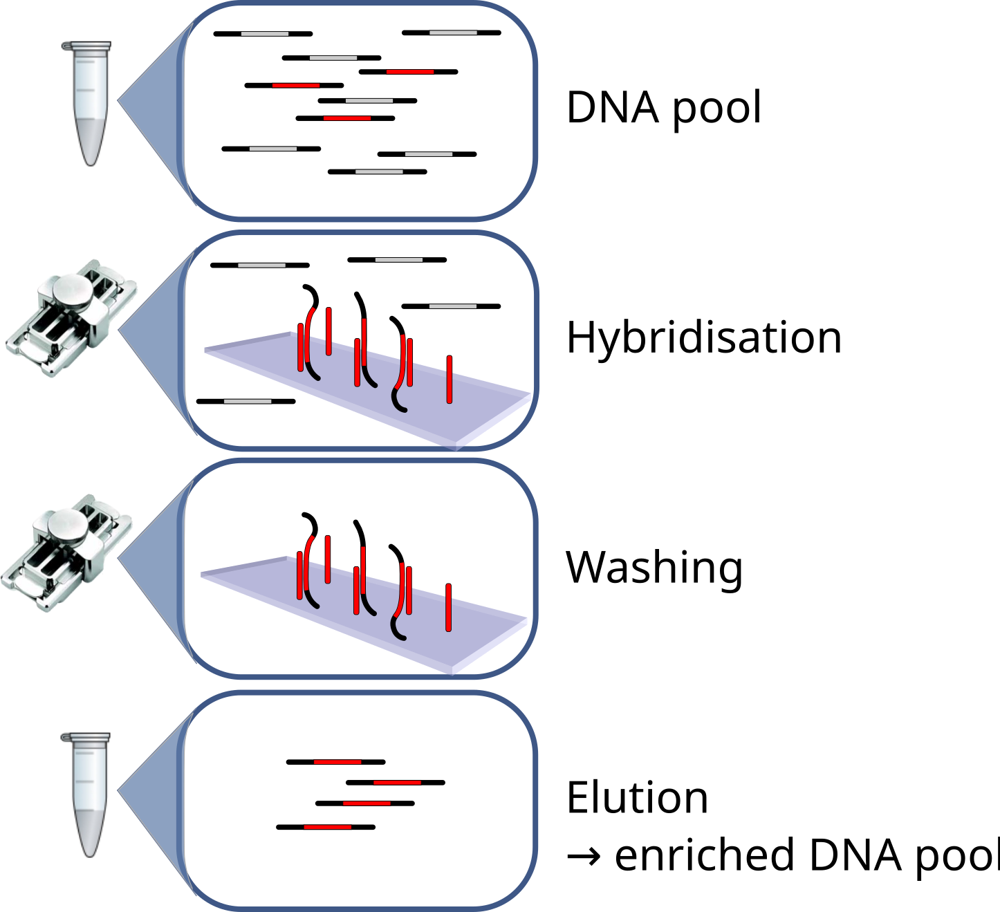
```

- Increased endogenous content
- Capture of specific regions 
- Cross-species capture


# DNA degradation

## Chemical DNA damage {.flexbox .vcenter}


```{r, out.height = "100%", fig.align='center'}
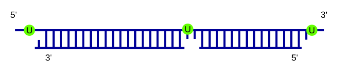
```

***→ Gets worse with time and poor preservation conditions***


## Nucleotide misincorporations

```{r, out.height=550, fig.align='center'}
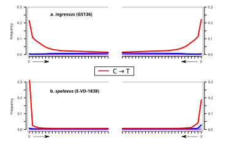
```


## Nucleotide misincorporations {.white-slide}


```{r, out.height = 520, fig.align='center', fig.cap="*Barlow et al. 2020, Genes*"}
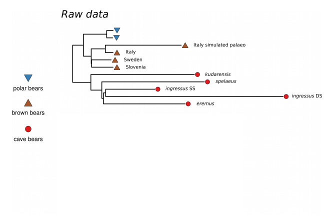
```

## Nucleotide misincorporations {.white-slide}


```{r, out.height = 520, fig.align='center', fig.cap="*Barlow et al. 2020, Genes*"}
include_graphics("./img/consensify2.svg")
```


# Applications

## Applications {.columns-2}

```{r, out.width = 300, fig.align='center'}
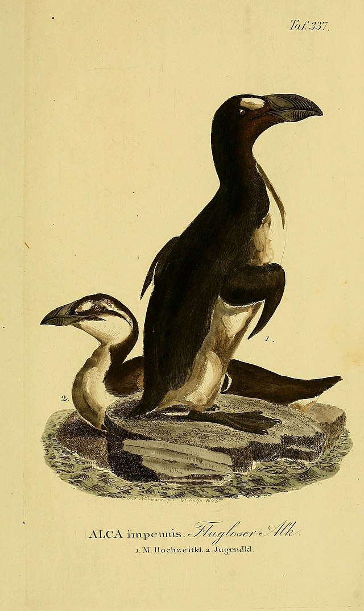
```

```{r, out.width = 350, fig.align='center'}
include_graphics("./img/Iberian_Lynx_front.jpg")
```


## Great Auk (*Pinguinus impennis*) <font size="6">(not a penguin)</font> 

```{r, out.width = 700, fig.align='center'}
include_graphics("./img/auk_distro.jpg")
```

<P align="right"><font size="4">*Thomas et al. 2019, eLife*</font></P>


## Extinction process {.flexbox .vcenter}

```{r, out.width = 600, fig.align='center'}
include_graphics("./img/pop_decline.svg")
```


## Cross-species hybridisation capture {.columns-2}

```{r, out.width = 400, fig.align='center'}
include_graphics("./img/killdeer.jpg")
```

<div style="height: 80px;"></div>
```{r, out.width = 300, fig.align='center'}
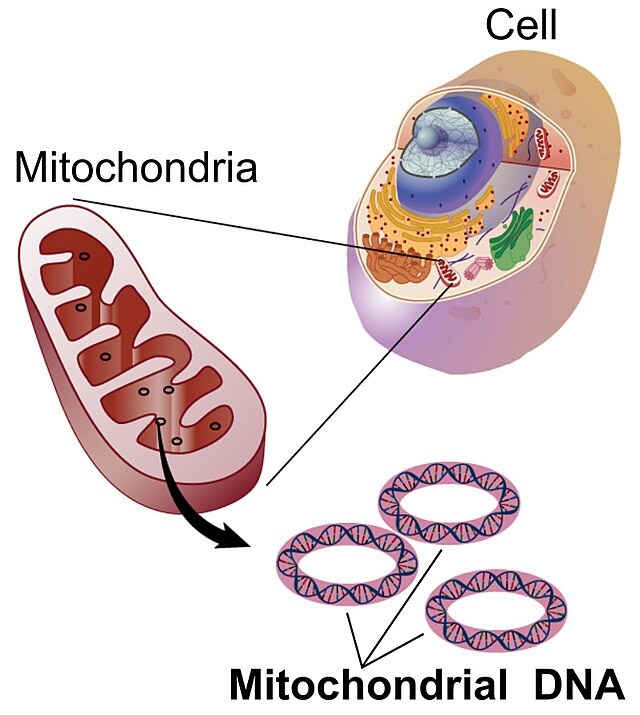
```


## No evidence for long-term decline {.flexbox .vcenter}

```{r, out.width = "100%", fig.align='center'}
include_graphics("./img/auk_network.jpg")
```

## No evidence for long-term decline {.white-slide}

```{r, out.width = 470, fig.align='center'}
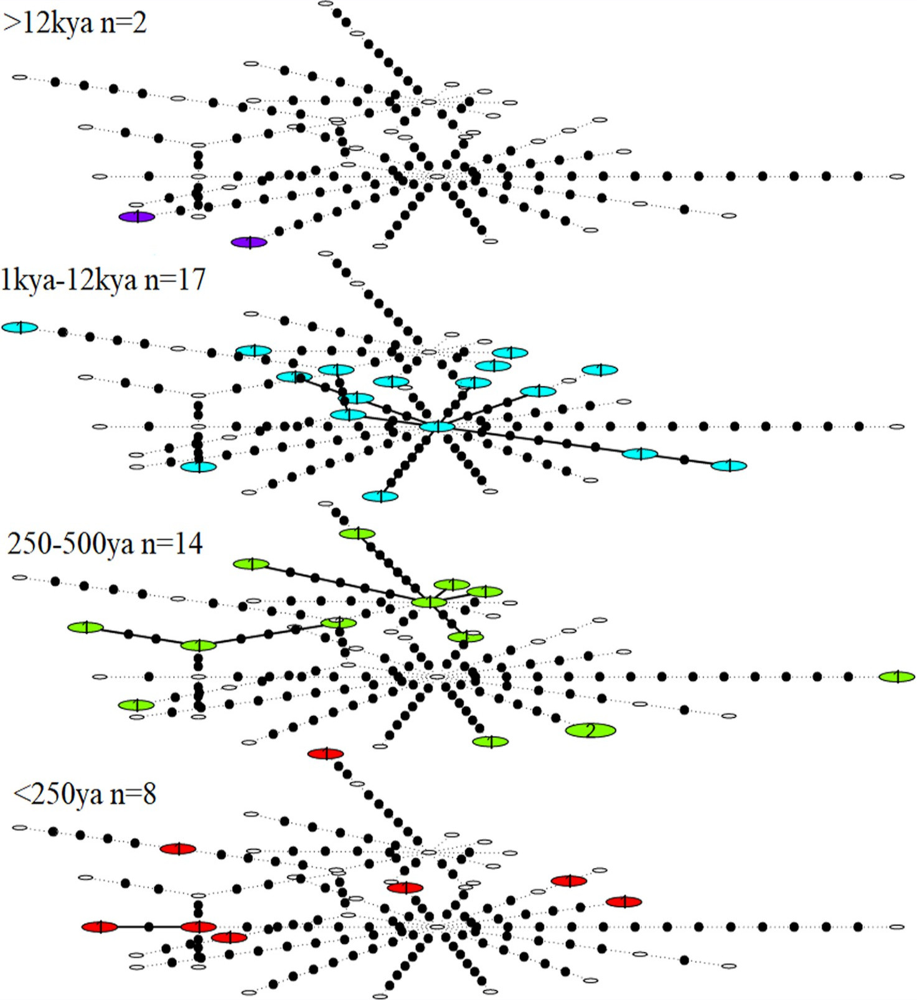
```


## Understanding extinction drivers


```{r, out.width = "100%", out.height=500}
include_graphics("./pdf/Thomas et al. - 2019 - Demographic reconstruction from ancient DNA supports rapid extinction of the great auk.pdf")
```


## Iberian lynx (*Lynx pardinus*) {.columns-2}

```{r, out.width = 400, fig.align='center'}
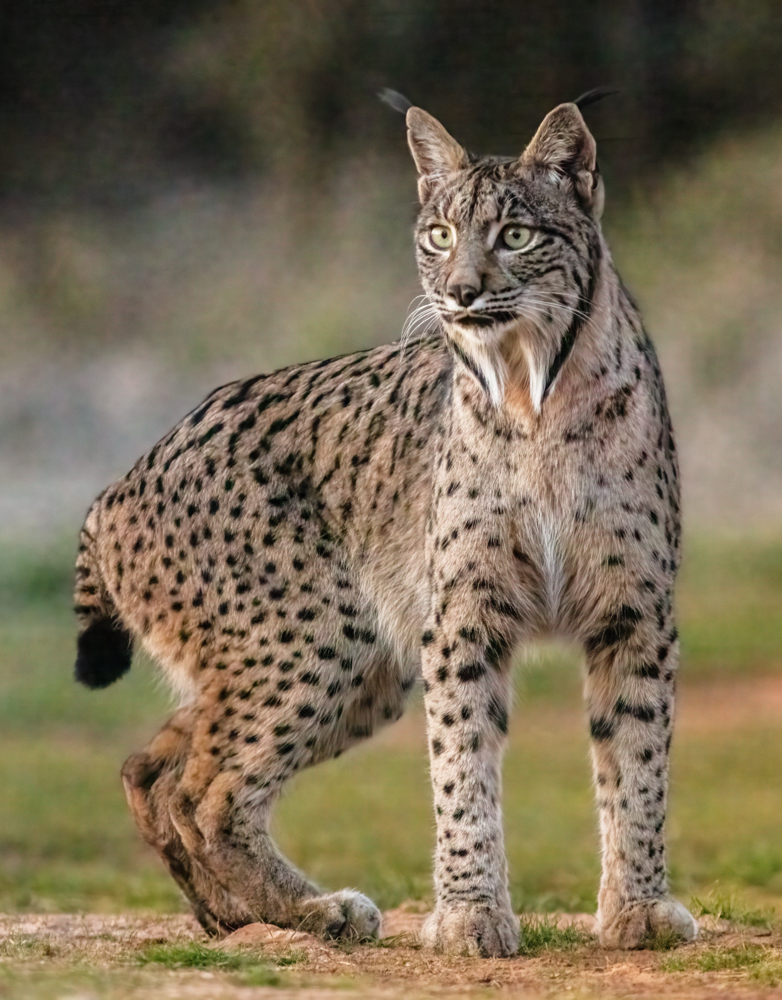
```


```{r, out.width = "95%", fig.align='center'}
include_graphics("./img/iberian_lynx_map.svg")
```

## Iberian lynx (*Lynx pardinus*) {.columns-2}

```{r, out.width = 400, fig.align='center'}

```


```{r, out.width = 400, fig.align='center'}
include_graphics("./img/pardinus_het.svg")
```

## Ancient Iberian lynx

```{r, out.width = 750, fig.align='center'}
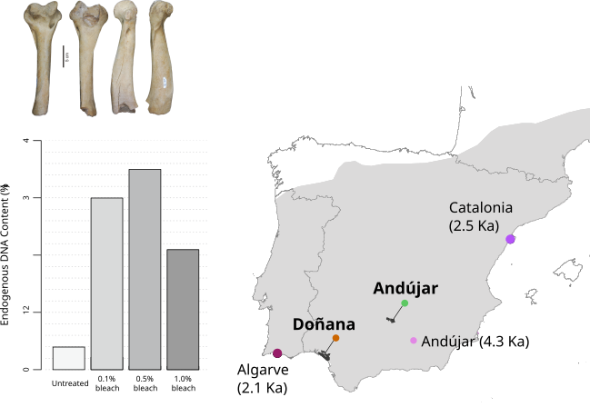
```

## Even lower heterozygosity in the past


```{r, out.width = 750, fig.align='center'}
include_graphics("./img/iberian_lynx_map_samples_div.svg")
```

## Eurasian lynx (*Lynx lynx*)

```{r, out.width = 800, fig.align='center'}
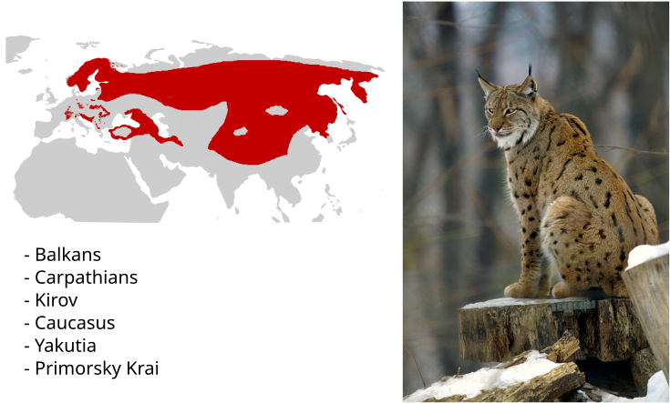
```


## Past admixture with Eurasian lynx

```{r, out.width = 720, fig.align='center'}
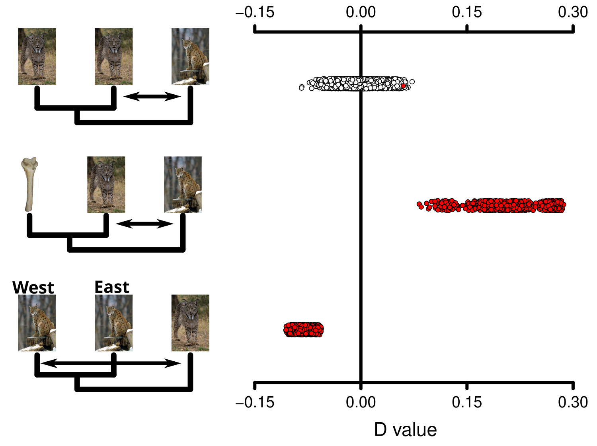
```


## Natural genetic rescue? 

```{r, out.width = "100%", out.height=500}
include_graphics("./pdf/Lucena-Perez et al. - 2024 - Recent increase in species-wide diversity after in.pdf")
```


## Conclusion: <br> <font size="40">*Is ancient DNA important for conservation?*</font> {.columns-2}  
  
- Investigation of "failed conservation"
- Tracking populations through time
- Measuring past genetic diversity

```{r, out.width = 500, fig.align='right'}
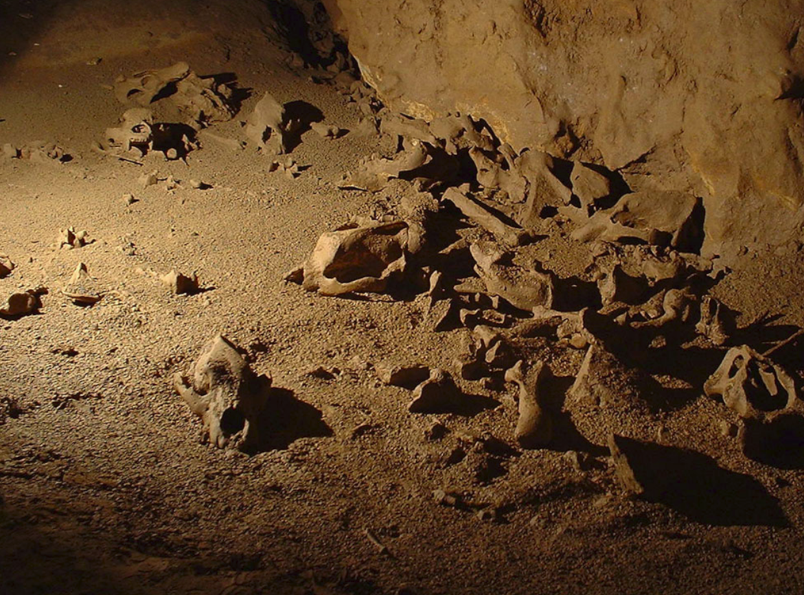
```

# Thank you!

